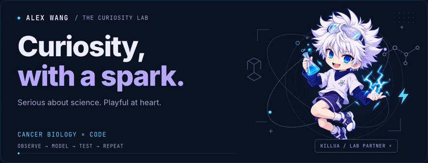
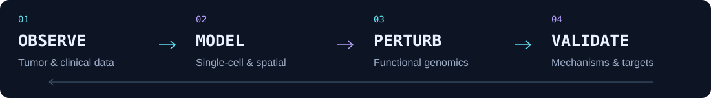
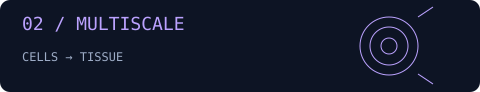

  <picture>
    <source media="(prefers-reduced-motion: reduce)" srcset="assets/curiosity-lab-poster.png" />
    
  </picture>

  <b>Experimental × computational cancer researcher</b> 
  Connecting molecular mechanisms, tumor omics, and experimental validation.

  
  &nbsp;
  

  <a href="#-the-scientist">About</a> ·
  <a href="#-research-playground">Projects</a> ·
  <a href="#-the-toolbox">Toolkit</a> ·
  <a href="#-selected-publications">Publications</a>

## 🧬 The scientist

Hi, I'm **Alex Wang**. I work across experiments and computation to **identify and validate therapeutic targets in cancer**, combining tumor omics, single-cell and spatial analysis, functional genomics, and in vivo models.

I also have experience in **DNA nanomedicine and targeted drug delivery**. I enjoy the space where an unexpected pattern becomes a testable question—and a question becomes an experiment.

**Rigorous science. Reproducible code. Room for playful ideas.**  
And yes, the white-haired scientist in this little lab is **Killua**. ⚡

<b>Inside the research questions</b>

- **Tumor-scale patterns** — large-scale tumor transcriptomics and clinical-data integration.
- **Cell-scale context** — single-cell analysis of tumor heterogeneity and the microenvironment.
- **Causal mechanisms** — functional validation with CRISPR screening, molecular biology, and tumor models.
- **Therapeutic delivery** — nanomedicine-based therapeutic delivery.

## 🧪 Research playground

Questions turned into reproducible analyses. Pick an experiment to explore.

<table>
  <tr>
    <td width="50%" valign="top">
      
      <h3><a href="https://github.com/Alex-w0731/breast-cancer-multiomics">Breast cancer multiomics ↗</a></h3>
      
Patient-aware integration of single-cell, spatial, and bulk RNA-seq, with reproducible synthetic validation and experimental design.

      
<code>Python</code> <code>Multiomics</code>

    </td>
    <td width="50%" valign="top">
      
      <h3><a href="https://github.com/Alex-w0731/multiscale-tumor-transcriptomics">Multiscale tumor transcriptomics ↗</a></h3>
      
scRNA-seq, spatial, and bulk RNA-seq integration with deconvolution, spatial statistics, survival modeling, and joint NMF.

      
<code>R</code> <code>Transcriptomics</code>

    </td>
  </tr>
  <tr>
    <td width="50%" valign="top">
      
      <h3><a href="https://github.com/Alex-w0731/tcga-luad-survival-analysis">TCGA-LUAD survival analysis ↗</a></h3>
      
Programmatic cBioPortal retrieval, cohort construction, Cox modeling, FDR correction, and survival visualization.

      
<code>R</code> <code>Survival analysis</code>

    </td>
    <td width="50%" valign="top">
      
      <h3><a href="https://github.com/Alex-w0731/single-cell-melanoma-analysis">Single-cell melanoma analysis ↗</a></h3>
      
Memory-conscious processing of GSE72056 with Scanpy dimensionality reduction, Leiden clustering, and marker analysis.

      
<code>Python</code> <code>Scanpy</code>

    </td>
  </tr>
</table>

## 🛠 The toolbox

<b>Computational tools & methods</b>

R · Python · bulk RNA-seq · scRNA-seq · ChIP-seq · Seurat · Scanpy · CellChat · CytoTRACE2 · Palantir · pySCENIC · pathway enrichment · survival analysis · reproducible visualization

<b>Experimental tools & methods</b>

Genome-wide CRISPR-Cas9 screening · qRT-PCR · Western blotting · Co-IP · flow cytometry · mammalian cell culture · xenograft models · H&E · IHC · immunofluorescence · confocal microscopy · quantitative pathology-image analysis

## 📚 Selected publications

- Wang Z\*, Liu Z\*, Yang Y\*, et al. KDM6B inhibition enhances chemotherapeutic response in small cell lung cancer via epigenetic regulation of apoptosis and ferroptosis. *Cell & Bioscience* (2025). [DOI ↗](https://doi.org/10.1186/s13578-025-01496-6)
- Li W\*, Wang Z\*, Su Q\*, et al. A reconfigurable DNA framework nanotube-assisted antiangiogenic therapy. *JACS Au* (2024). [DOI ↗](https://doi.org/10.1021/jacsau.3c00661)
- Yang Y\*, Liu Z\*, Wang Z\*, et al. Large-scale bulk and single-cell RNA sequencing combined with machine learning reveals glioblastoma-associated neutrophil heterogeneity and establishes a VEGFA+ neutrophil prognostic model. *Biology Direct* (2025). [DOI ↗](https://doi.org/10.1186/s13062-025-00640-z)

* Co-first authors.

  <b>Good science starts with a question. Great adventures do, too.</b> 
  认真探索，也保持好玩。 ⚡  
  <a href="mailto:Alexw0731@icloud.com">Let's exchange ideas</a> · <a href="https://orcid.org/0009-0005-8480-5387">ORCID</a> 
  <a href="assets/CREDITS.md">Original Killua lab animation & artwork</a> · <a href="motion/index.html">How it's made</a>

