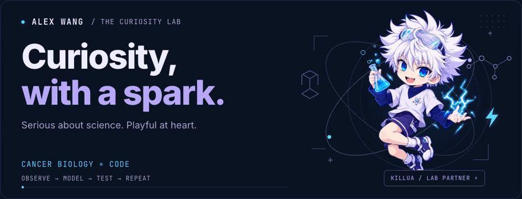
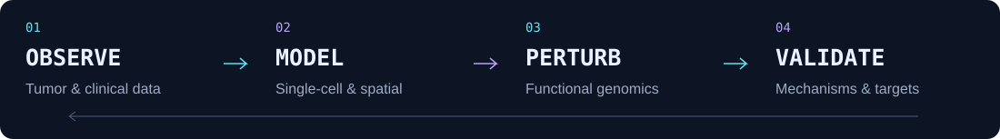
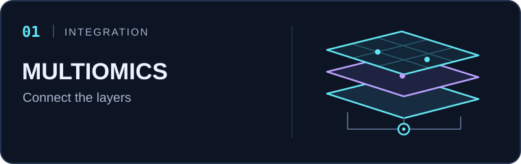
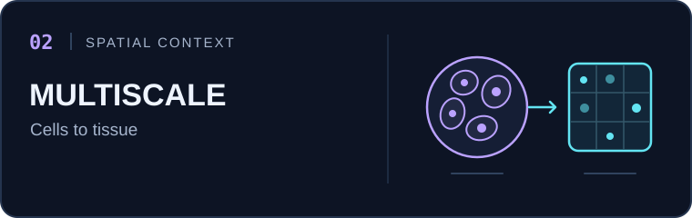
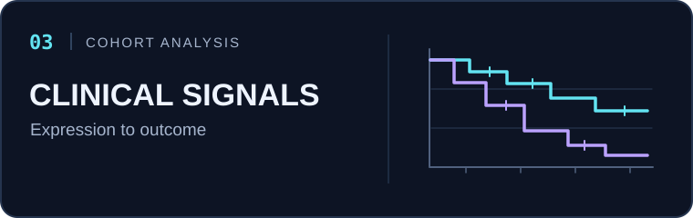
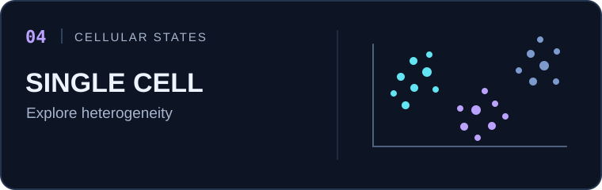
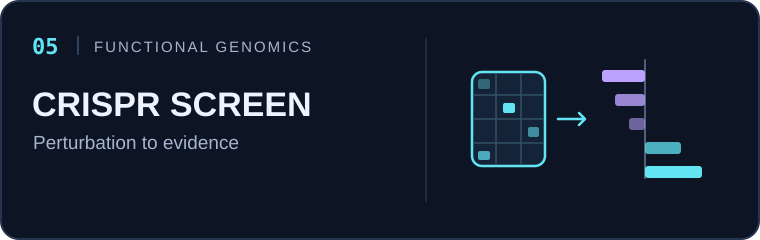
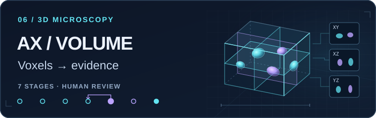
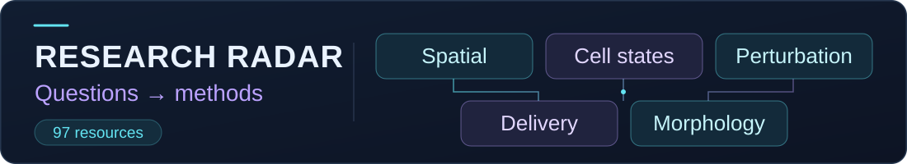

  <picture>
    <source media="(prefers-reduced-motion: reduce)" srcset="assets/curiosity-lab-poster.png" />
    
  </picture>

  <b>Experimental × computational cancer research</b> 
  Molecular mechanisms · Tumor omics · Functional validation

  
  &nbsp;
  

  <a href="#research-focus">Research focus</a> &nbsp;·&nbsp;
  <a href="#selected-work">Selected work</a> &nbsp;·&nbsp;
  <a href="#3d-microscopy">3D workflow</a> &nbsp;·&nbsp;
  <a href="#selected-publications">Publications</a>

## Research focus

Hi, I'm **Alex Wang**. I connect experiments and computation to **identify and validate therapeutic targets in cancer**.

My work spans tumor omics, single-cell and spatial analysis, functional genomics, and in vivo models. I also have experience in **DNA nanomedicine and targeted drug delivery**.

<b>The questions behind the work</b>

- **Tumor-scale patterns** — large-scale tumor transcriptomics and clinical-data integration.
- **Cell-scale context** — tumor heterogeneity and the microenvironment.
- **Causal mechanisms** — CRISPR screening, molecular biology and tumor models.
- **Therapeutic delivery** — nanomedicine-based therapeutic delivery.

I enjoy the space where an unexpected pattern becomes a testable question—and a question becomes an experiment.

## Selected work

**From a biological question to an inspectable analysis.** Six starting points from the lab.

<table>
  <tr>
    <td width="50%" valign="top">
      
      <h3><a href="https://github.com/Alex-w0731/breast-cancer-multiomics">Breast cancer multiomics ↗</a></h3>
      
Integrate single-cell, spatial and bulk RNA-seq with patient-aware analysis and synthetic checks.

      
<code>Python</code> <code>Multiomics</code>

    </td>
    <td width="50%" valign="top">
      
      <h3><a href="https://github.com/Alex-w0731/multiscale-tumor-transcriptomics">Multiscale tumor transcriptomics ↗</a></h3>
      
Connect cell states to tissue context through deconvolution, spatial analysis and joint NMF.

      
<code>R</code> <code>Transcriptomics</code>

    </td>
  </tr>
  <tr>
    <td width="50%" valign="top">
      
      <h3><a href="https://github.com/Alex-w0731/tcga-luad-survival-analysis">TCGA-LUAD survival analysis ↗</a></h3>
      
Retrieve cBioPortal cohorts, model survival and report Cox estimates with FDR correction.

      
<code>R</code> <code>Survival analysis</code>

    </td>
    <td width="50%" valign="top">
      
      <h3><a href="https://github.com/Alex-w0731/single-cell-melanoma-analysis">Single-cell melanoma analysis ↗</a></h3>
      
Explore GSE72056 with Scanpy, from memory-conscious preprocessing to clustering and markers.

      
<code>Python</code> <code>Scanpy</code>

    </td>
  </tr>
  <tr>
    <td width="50%" valign="top">
      
      <h3><a href="https://github.com/Alex-w0731/breast-cancer-multiomics/tree/main/modules/crispr-screen">CRISPR Screen Workbench ↗</a></h3>
      
Guide QC and MAGeCK RRA, plus separate SCLC/TNBC gene-summary audits and synthetic checks.

      
<code>Python</code> <code>MAGeCK</code>

    </td>
    <td width="50%" valign="top">
      
      <h3><a href="research/3d-imaging/README.en.md">AX / VOLUME · 3D microscopy ↗</a></h3>
      
Plan calibrated 3D analysis, review orthogonal slices and export a reproducible run plan.

      
<code>Microscopy</code> <code>Research planner</code>

    </td>
  </tr>
</table>

Project illustrations are schematics, not experimental results. AX / VOLUME provides a synthetic demonstration and run planning; it has no browser AI inference backend.

<b>Explore the CRISPR screen case studies</b>

[KDM6B / SCLC case](https://github.com/Alex-w0731/breast-cancer-multiomics/blob/main/modules/crispr-screen/docs/cases/sclc/README.md) · [TNBC metastasis case](https://github.com/Alex-w0731/breast-cancer-multiomics/blob/main/modules/crispr-screen/docs/cases/nc/README.md) · [Synthetic demo](https://github.com/Alex-w0731/breast-cancer-multiomics/blob/main/modules/crispr-screen/docs/demo/README.md)

Guide-level quality control, MAGeCK RRA and separate contrasts across cell lines. Published gene-summary case studies and synthetic count validation have different evidence limits; the case pages document them.

## 3D microscopy

**AX / VOLUME** connects physical calibration, candidate segmentation and human review with measurement in the original label space.

[**Explore the workflow →**](research/3d-imaging/README.en.md) &nbsp;·&nbsp; [English workbench ↓](research/3d-imaging/workbench.en.html) &nbsp;·&nbsp; [中文工作台 ↓](research/3d-imaging/workbench.html)

[English guide](research/3d-imaging/GUIDE.en.md) · [中文指南](research/3d-imaging/GUIDE.zh-CN.md) · [中文流程](research/3d-imaging/README.md) · [Sources & licenses](research/3d-imaging/SOURCES.en.md)

Research planner + synthetic 3D demonstration. Real data, models and measurements require external tools and sample-specific validation.

<b>Seven stages, review gates and getting started</b>

Physical calibration → multiscale data → optional reconstruction → candidate segmentation → human review → native-label quantification → reproducible evidence.

- **Inspect before interpreting** — preserve axes, physical units, channel identity and raw-data checksums.
- **Review across scales** — use a low-resolution overview, then check original-resolution ROIs, raw slices, labels and revisions.
- **Keep measurement traceable** — quantify native labels; save display meshes, transforms and software versions separately. Spatial association does not establish causality.

Download <code>workbench.en.html</code> for English or <code>workbench.html</code> for Chinese and open it in a browser. Rotate the synthetic volume, inspect orthogonal slices, compare threshold sensitivity and export a run plan. Each file works independently; save both in the same folder to use the language links.

For real TIFFs, the [QC tool](research/3d-imaging/scripts/inspect_tiff.py) checks axes, spacing, intensity limits and optional instance-label volumes. [Nine synthetic tests](research/3d-imaging/scripts/tests/test_inspect_tiff.py) verify the QC tool; they are not biological or model-validation results. The [execution guide](research/3d-imaging/GUIDE.en.md) connects OME-Zarr, BigStitcher or multiview-stitcher, Cellpose, napari and scientific rendering.

The browser does not read real samples or run model inference. Sources checked 2 October 2026.

## Tools & methods

**Compute** — tumor omics, cell states and reproducible analysis. 
**Validate** — functional genomics, tumor models and quantitative imaging.

<b>Computational toolkit</b>

R · Python · bulk RNA-seq · scRNA-seq · ChIP-seq · Seurat · Scanpy · CellChat · CytoTRACE2 · Palantir · pySCENIC · pathway enrichment · survival analysis · reproducible visualization

<b>Experimental toolkit</b>

Genome-wide CRISPR-Cas9 screening · qRT-PCR · Western blotting · Co-IP · flow cytometry · mammalian cell culture · xenograft models · H&E · IHC · immunofluorescence · confocal microscopy · quantitative pathology-image analysis

## Research radar

A curated map of **97 public GitHub resources** for experimental and computational cancer research.

[**Explore the roadmap →**](research/README.md) · [中文研究路线与90天计划](research/README.zh-CN.md) · [Full catalogue](research/CATALOGUE.zh-CN.md)

<b>Five directions to explore</b>

| Research question | Methods to evaluate |
|---|---|
| Spatial context and treatment vulnerability | SpatialData · BANKSY · LIANA+ · MultiNicheNet |
| Resistant states and lineage dynamics | CellRank · moscot · Cassiopeia · SCENIC+ |
| Perturbation models and experimental choices | SCEPTRE · State · linear baselines · cell-eval |
| Geometry and effective delivery | scadnano · oxDNA · Ax |
| Morphology, transcription and function | CellProfiler · Pycytominer · QuPath · COSMOS |

A learning and evaluation roadmap with data requirements, validation steps and stopping conditions. Inclusion does not imply that I have used or validated every tool. [Sources & license notes](research/SOURCES.md) · Checked 26 September 2026.

## Selected publications

**2025 · Cell & Bioscience** 
[**KDM6B inhibition enhances chemotherapeutic response in small cell lung cancer via epigenetic regulation of apoptosis and ferroptosis. ↗**](https://doi.org/10.1186/s13578-025-01496-6) 
Wang Z&#42;, Liu Z&#42;, Yang Y&#42;, et al.

**2024 · JACS Au** 
[**A reconfigurable DNA framework nanotube-assisted antiangiogenic therapy. ↗**](https://doi.org/10.1021/jacsau.3c00661) 
Li W&#42;, Wang Z&#42;, Su Q&#42;, et al.

**2025 · Biology Direct** 
[**Large-scale bulk and single-cell RNA sequencing combined with machine learning reveals glioblastoma-associated neutrophil heterogeneity and establishes a VEGFA+ neutrophil prognostic model. ↗**](https://doi.org/10.1186/s13062-025-00640-z) 
Yang Y&#42;, Liu Z&#42;, Wang Z&#42;, et al.

* Co-first authors.

  <b>Rigorous science. Reproducible code. Room for playful ideas.</b> 
  认真探索，也保持好玩。 ⚡  
  <a href="mailto:Alexw0731@icloud.com">Let's exchange ideas</a> &nbsp;·&nbsp; <a href="https://orcid.org/0009-0005-8480-5387">ORCID</a> 
  Lab partner: Killua · <a href="assets/CREDITS.md">Artwork & credits</a> · <a href="motion/index.html">How it's made</a>

