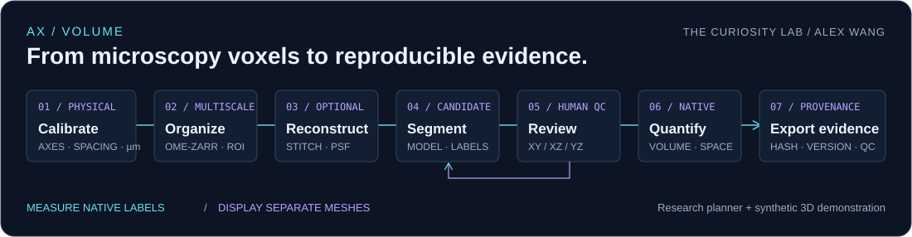
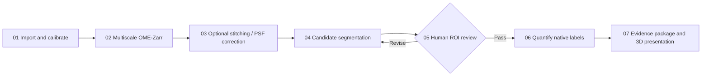

# AX / VOLUME

**English** · [中文](README.md)

**Alex Wang's 3D microscopy workflow** for confocal z-stacks, volumetric TIFFs, cells, and the tumor microenvironment.



Start with verified axes and physical calibration, then connect multiscale data, optional reconstruction, candidate segmentation, human correction, native-space measurements, and reproducible evidence. The workflow combines established tools while retaining their individual requirements and limitations. See the [official sources and license notes](SOURCES.en.md).

## Use the interactive workbench

**[Download the English workbench](workbench.en.html)**: open its file page, choose **Download raw file**, save `workbench.en.html`, and open it in a browser. It is a standalone HTML file with no frontend installation, external CDN, or image-data upload. GitHub READMEs cannot run JavaScript, so the interactive workbench is provided separately.

The header links to the Chinese version. When using downloaded files, save both HTML files in the same folder to switch between them. Each version works independently.

You can:

- Click seven workflow nodes to inspect operations, prerequisites, and review gates.
- Configure axis order, Z/Y/X voxel spacing, segmentation targets, stitching, and PSF branches; export a JSON plan and a text runbook.
- Rotate a synthetic volume, switch between raw signal and candidate labels, and inspect linked orthogonal slices. Arrow keys also rotate the volume.
- Compare voxel-based volumes at three neighboring thresholds to explore boundary sensitivity.
- Record review preparation while keeping raw images, automatic labels, revised labels, and display meshes as separate analysis products.

**The demonstration uses voxel arrays generated with a fixed seed. It does not run Cellpose or read real samples.** Volumes are computed from synthetic labeled voxels; seed-label counts are not real segmentation-derived cell counts. Parameter sensitivity is not accuracy. Run real processing locally or on an authorized research server; the browser has no AI inference backend.

Initial axes and voxel spacing are examples. Update them from acquisition records and confirm calibration before exporting. Editing axes or spacing clears that confirmation. The runbook first reads OME metadata without overriding it.

## Where to start

| Resource | Purpose |
|---|---|
| [English execution guide](GUIDE.en.md) | Seven real-data stages, parameter selection, ROI review, and tumor-study design |
| [Sources and license notes](SOURCES.en.md) | Six main reference projects and supporting components, verified capabilities, limitations, and design influences |
| [TIFF inspection script](scripts/inspect_tiff.py) | Metadata, intensity QC, physical spacing, and voxel measurements for supplied labels |
| [Synthetic validation tests](scripts/tests/test_inspect_tiff.py) | Axes, units, anisotropic volume, nonfinite values, intensity ceilings, memory limits, and CLI behavior |

### Explore the workflow nodes



### Inspect a real TIFF first

Run from the repository root, preferably in a separate Python environment:

```powershell
python -m pip install -r research/3d-imaging/requirements-qc.txt
python research/3d-imaging/scripts/inspect_tiff.py --input YOUR_STACK.ome.tif --output qc.json --sha256
```

Complete OME metadata can supply axes and PhysicalSizeXYZ. For ordinary TIFFs with missing information, verify acquisition records before providing explicit values, for example:

```powershell
python research/3d-imaging/scripts/inspect_tiff.py --input YOUR_STACK.tif --axes ZYX --spacing 0.8 0.2 0.2 --output qc.json --sha256
```

The spacing `0.8 0.2 0.2` is **an example in µm**. Replace it with the verified spacing of your acquisition.

For a registered, same-shaped, nonnegative integer ZYX instance-label volume:

```powershell
python research/3d-imaging/scripts/inspect_tiff.py --input ONE_CHANNEL_ZYX.tif --axes ZYX --spacing 0.8 0.2 0.2 --labels FINAL_LABELS_ZYX.tif --output objects-qc.json --sha256
```

The script inspects the first TIFF series and loads arrays in full. By default, it rejects combined decoded arrays larger than 1 GiB; peak memory also includes decoding and statistics overhead. `--labels` requires strictly matching ZYX arrays. Select and save a target volume first for multichannel or time-series inputs. Each positive integer ID is treated as one object; disconnected regions sharing an ID are not split. Centroids are relative to the center of the first voxel, without a stage origin or registration transform.

Without verified spacing, the script omits µm³ measurements. The dtype-ceiling fraction reports the storage limit, not proven detector saturation. If the detector ceiling is known, supply its actual value, such as `--detector-max 4095`. The script does not perform segmentation, deconvolution, or model inference.

### Validate the inspection tool

```powershell
python -B -m unittest discover -s research/3d-imaging/scripts/tests -p "test_inspect_tiff.py" -v
```

The first release passed nine synthetic tests. These validate program behavior, not real-sample segmentation or biological conclusions.

## Three combined design ideas

1. **Connect global context to local evidence.** Use multiscale 3D navigation and native-resolution ROIs with XY/XZ/YZ checks. napari's current multiscale 3D display uses the lowest-resolution level; native-resolution ROI inspection requires a separate load.
2. **Let QC send work back to the right stage.** Axes, units, seams, border objects, and segmentation differences determine when a step needs revision. Establish thresholds using actual validation samples; do not report invented Dice scores for unlabeled data.
3. **Save measurement and presentation layers separately.** Derive volumes and spatial distances from native labels. Record smoothing, simplification, and camera settings for display meshes separately. Trace results back to checksums, models, parameters, and human revisions.

These are the project's combined design choices. The first workbench implements planning, synthetic volume rendering, and configuration export. Real OME-Zarr conversion, stitching, AI inference, and label editing happen in the linked research tools. Tumor–microenvironment associations still require independent biological samples, experimental controls, and subsequent mechanistic validation.

## Optional: enable GitHub Pages

To open the workbench online, save **Settings → Pages → Deploy from a branch → main / (root)** in this repository. The root `index.html` opens the Chinese workbench; its English link opens the English version. After deployment, the English address is `https://alex-w0731.github.io/Alex-w0731/research/3d-imaging/workbench.en.html`. Downloadable repository source does not mean Pages is published; this is an activation guide, not a claim that the URL is currently live.

No GitHub Actions workflow, server, or secret credentials are needed. Publishing keeps the workbench a static planner; it does not add real inference capabilities.

---

[Back to the GitHub profile](https://github.com/Alex-w0731) · Sources checked 2 October 2026 · Original code and documentation: [MIT license](LICENSE). Upstream components retain their own licenses.
