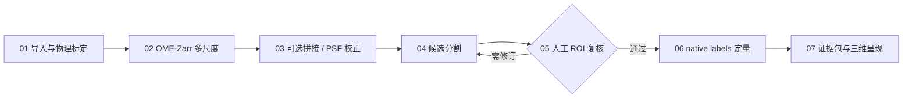

# AX / VOLUME

**Alex Wang 的显微三维成像 workflow** · 共聚焦、三维 TIFF、细胞与肿瘤微环境研究。


从可信的轴与物理尺度开始，将多尺度数据、可选重建、候选分割、人工修订、原始空间定量与可复现证据串成一条路线。借鉴工具的做法并保留各自适用条件；来源见 [官方项目与许可记录](SOURCES.md)。

## 使用交互工作台

**[下载工作台 HTML](workbench.html)**：打开文件页面的 Download raw file，保存 `workbench.html`，用浏览器打开。只有一个文件，无前端安装、外部 CDN 或在线数据上传。GitHub 的 README 无法直接执行 JavaScript，工作台因此作为独立 HTML 提供。

你可以立即：

- 点击七个流程节点，查看具体操作、输入条件与返回检查点。
- 配置轴顺序、Z/Y/X 体素间距、目标、拼接与 PSF 支路；导出 JSON 与执行清单。
- 旋转合成体数据，切换原始信号与候选标签，联动三正交切片；键盘方向键可旋转。
- 比较三个邻近阈值下的体素体积，观察对分割边界的敏感性。
- 记录人工复核准备状态；原始图、自动标签、修订标签和展示网格分别归档。

**演示使用固定种子生成的体素数据，未运行 Cellpose，也未读取真实样本。** 体积来自合成标签体素计数；种子标签数不等同于真实分割出的细胞数。参数敏感性不代表准确率。真实步骤在本地或授权科研服务器运行，页面没有 AI 推理后台。

## 从哪里开始

| 入口 | 作用 |
|---|---|
| [中文执行指南](GUIDE.zh-CN.md) | 真实数据的七步操作、参数选择、ROI 复核和肿瘤研究设计 |
| [来源与许可](SOURCES.md) | 六个主要参考项目及其他组件，核实能力、限制和借鉴方式 |
| [TIFF 检查脚本](scripts/inspect_tiff.py) | 元数据、强度 QC、物理间距与已提供标签的体素计量 |
| [合成验证测试](scripts/tests/test_inspect_tiff.py) | 轴顺序、单位转换、各向异性体积、NaN、位深上限、内存边界与 CLI |

### 点击路线节点



### 先检查一份真实 TIFF

从仓库根目录运行；建议独立 Python 环境：

```powershell
python -m pip install -r research/3d-imaging/requirements-qc.txt
python research/3d-imaging/scripts/inspect_tiff.py --input YOUR_STACK.ome.tif --output qc.json --sha256
```

完整 OME 元数据可提供 axes 与 PhysicalSizeXYZ。普通 TIFF 如缺少可靠信息，在核对采集记录后显式填写，例如：

```powershell
python research/3d-imaging/scripts/inspect_tiff.py --input YOUR_STACK.tif --axes ZYX --spacing 0.8 0.2 0.2 --output qc.json --sha256
```

上面的 `0.8 0.2 0.2` **仅为示例 µm 间距**，必须替换为真实采集尺度。

有同形、同空间、非负整数的 ZYX 实例标签时：

```powershell
python research/3d-imaging/scripts/inspect_tiff.py --input ONE_CHANNEL_ZYX.tif --axes ZYX --spacing 0.8 0.2 0.2 --labels FINAL_LABELS_ZYX.tif --output objects-qc.json --sha256
```

该脚本读取第一 series，全量加载；默认拒绝超过 1 GiB 的组合解码数组，峰值内存还包含解码器与统计开销。`--labels` 只支持严格同形 ZYX 输入，多通道/时间输入应先选定并保存目标体数据。一个正整数 ID 视为一个对象，不自动拆分相同 ID 的多个连通块。质心相对第一个体素中心，不包含载物台原点或注册变换。

缺少可靠 spacing 时不输出 µm³；dtype 最大值比例只是存储上限比例。知道真实 detector 上限时可填写 `--detector-max 4095` 等实际值。脚本不做分割、去卷积或模型推理。

### 验证检查工具

```powershell
python -B -m unittest discover -s research/3d-imaging/scripts/tests -p "test_inspect_tiff.py" -v
```

首版在合成数据上通过 9 项测试；这验证程序行为，不构成真实样本分割或生物学验证。

## 三个组合创新

1. **全局概览与局部证据联通**：多尺度 3D 定位，原始 ROI 与 XY/XZ/YZ 校验。napari 当前三维多尺度显示最低分辨率，ROI 精查需要独立加载原分辨率。
2. **QC 驱动流程返回**：轴、单位、接缝、触边与分割差异决定是否回到前一步。阈值从实际验证样本确定，未标注数据不伪造 Dice。
3. **测量层与展示层分别保存**：体积与空间距离来自 native labels；展示 mesh 的平滑、简化与相机配置单独记录。每个结果可回查数据校验和、模型、参数与人工修订。

这些是本项目的组合设计；首版工作台实现了规划、合成体绘制与配置导出，真实 OME-Zarr、拼接、AI 推理与标签编辑通过链接的科研工具完成。肿瘤细胞与微环境空间关联仍需独立生物样本、实验对照和后续机制验证。

## 可选：启用 GitHub Pages

如果希望在线打开工作台，在本仓库 **Settings → Pages → Deploy from a branch → main / (root)** 保存。根目录 `index.html` 会打开这个工作台；发布后地址为 `https://alex-w0731.github.io/Alex-w0731/`。仓库源码可下载不代表 Pages 已发布；这里只给出启用方法，不宣称该 URL 当前可用。

无需 GitHub Actions、服务器或秘密凭据。网站仍是静态规划器，不会因此获得真实推理能力。

---

[返回 GitHub 主页](https://github.com/Alex-w0731) · 来源核查 2026-10-02 · 原创代码和文档见 [MIT 许可](LICENSE)；上游组件许可独立适用。
